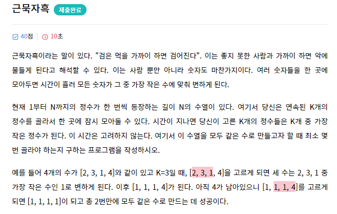
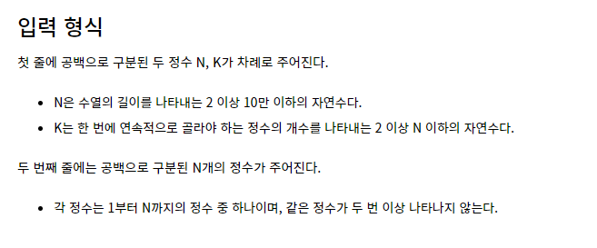

### 문제





----

### Test case

```
4 3
2 3 1 4
```

```
2
```

```
8 3
7 3 1 8 4 6 2 5
```

```
4
```

```
37 4
31 36 20 30 1 9 6 13 3 29 11 25 7 8 2 24 34 18 26 15 23 28 37 19 21 4 32 14 16 10 12 27 22 35 5 17 33
```

```
12
```

---

### 풀이

```python
N, K = map(int, input().split())
result = 0
# N개의 숫자들이 정렬되어 있다고 가정한다.
# N개의 숫자에서 처음 K개의 숫자를 같은 수로 만든다.
N = N - K
result += 1
# 남은 숫자를 (K-1)로 나눈 몫과 나머지를 구한다.
D, R = N // (K-1) , N % (K-1)
# 몫을 더하고 나머지가 있다면 1을 한번 더 더한다.
if R:
	result = result + D + 1
else:
	result = result + D
# 결과를 출력한다.
print(result)
```

