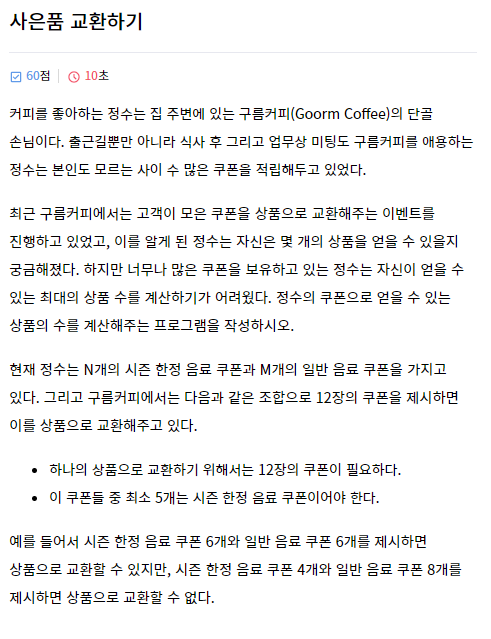
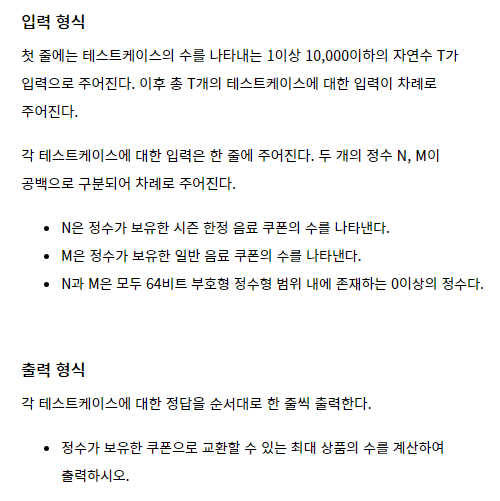

### 문제





---

### Test case

```
4
12 0
10 14
4 20
5 2147483648
```

```
1
2
0
1
```

---

### 풀이

```python
T = int(input())
for tc in range(T):
	N, M = map(int, input().split())
	result1, result2 = 0, 0
	
    # 한정 음료 쿠폰이 적어도 5장 있어야 한다.
	result1 = N // 5
    
    # 쿠폰이 12장이 있어야 교환할 수 있다.
	result2 = (N + M) // 12
	
    # 두 결과 중 작은 값을 출력한다.
	if result1 <= result2:
		print(result1) 
	else: 
		print(result2)	
```