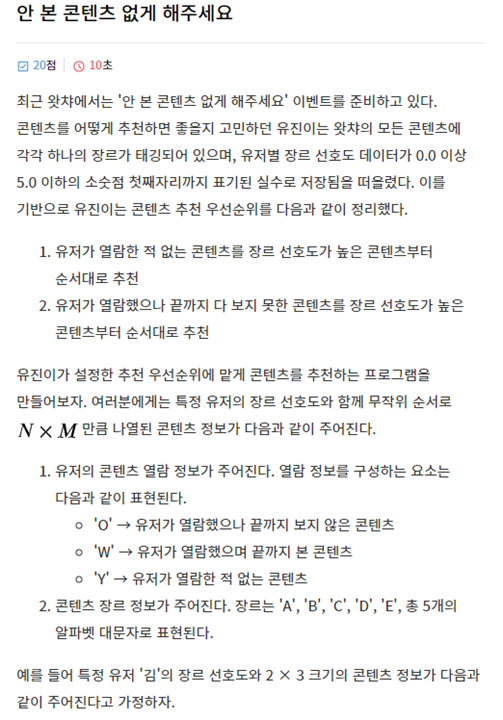
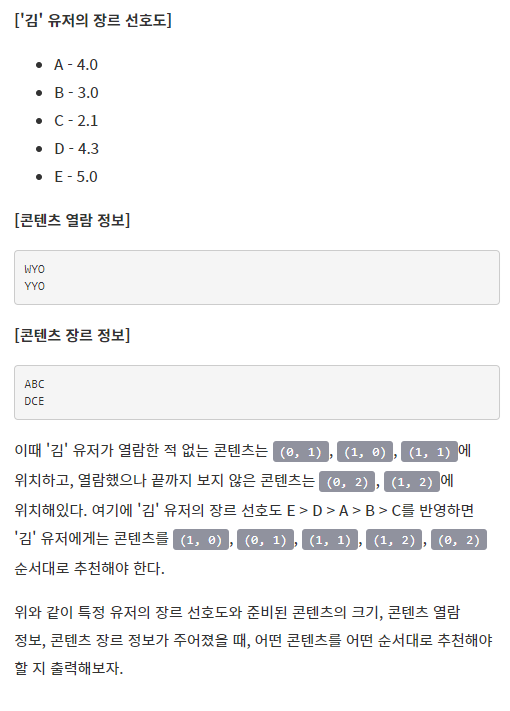
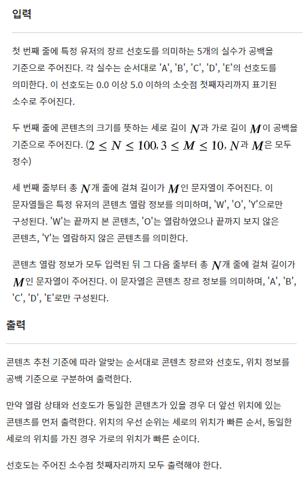

### 문제







---

### Test case

```
4.0 3.0 2.1 4.3 5.0
2 3
WYO
YYO
ABC
DCE
```

```
D 4.3 1 0
B 3.0 0 1
C 2.1 1 1
E 5.0 1 2
C 2.1 0 2
```

---

### 풀이

```python
movie = ['A', 'B', 'C', 'D', 'E']
score = list(map(float, input().split()))
N, M = map(int, input().split())
contents = [list(input()) for _ in range(N)]
genre = [list(input()) for _ in range(N)]

# 열람한 적 없는 콘텐츠 ('Y')와 끝까지 보지 못한 콘텐츠 ('O') 영화 이름을 추출합니다.
Y_movie = []
O_movie = []
for i in range(N):
    for j in range(M):
		if contents[i][j] == "Y":
			Y_movie.append([genre[i][j], score[movie.index(genre[i][j])], i, j])
		if contents[i][j] == "O":
			O_movie.append([genre[i][j], score[movie.index(genre[i][j])], i, j])

# 해당 콘텐츠가 있다면, 선호도 순으로 정렬하고 정보를 출력합니다.
if Y_movie:
	Y_movie.sort(key=lambda x : -x[1])
	for i in range(len(Y_movie)):
		print(f'{Y_movie[i][0]} {Y_movie[i][1]} {Y_movie[i][2]} {Y_movie[i][3]}')
if O_movie:
	O_movie.sort(key=lambda x : -x[1])
	for i in range(len(O_movie)):
		print(f'{O_movie[i][0]} {O_movie[i][1]} {O_movie[i][2]} {O_movie[i][3]}')
```

