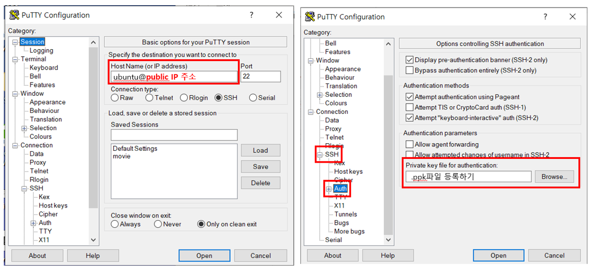
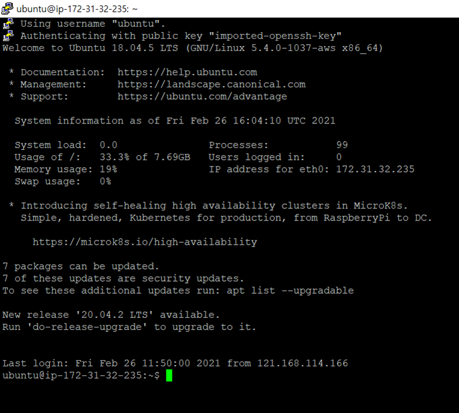
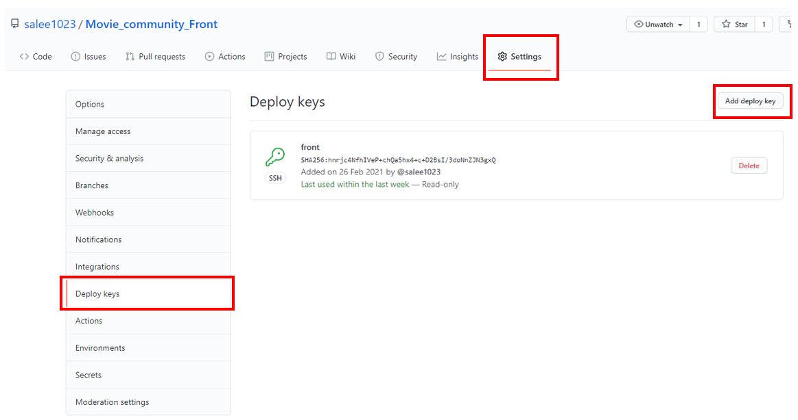

> 현생에 치여 미루고 미뤄왔던 배포에 도전한다 ✨ (구글과 함께라면 무엇이든 할 수 있어...!) 


### 01. AWS 계정만들기

- [AWS](https://aws.amazon.com/ko/) 에서 `루트 계정`(AWS를 처음 이용한다면!)과 `IAM`(AWS Identity and Access Management) 유저를 생성한다. 

- `IAM 유저`로 로그인하면 루트 계정은 안전하게 보관하면서 네트워크를 구성할 수 있다. (AWS 권장사항)

- 루트 계정에 추가로 `MFA (Multi-Factor Authentication)` 을 활성화하면 보안을 더 강화할 수 있다.
- (참고) [NDS의 'IAM 유저 및 MFA  생성하기' ](https://tech.cloud.nongshim.co.kr/2018/10/11/%EC%B4%88%EB%B3%B4%EC%9E%90%EB%A5%BC-%EC%9C%84%ED%95%9C-aws-%EC%9B%B9%EA%B5%AC%EC%B6%95-2-iam-%EC%9C%A0%EC%A0%80-%EC%83%9D%EC%84%B1%ED%95%98%EA%B8%B0/) 글에 매우 자세하게 나와있다. 

<br/><br/>

### 02. AWS EC2 인스턴스 생성하기

- `EC2`에서 새로운 인스턴스를 생성한다.
- ❗❗❗ 인스턴스 생성할 때 생성하는 `키(.pem)` 는 반드시 잘 보관해야한다. **(깃허브에 절대 올리지 말 것)**
- `EC2` 는 인스턴스를 중지하고 다시 시작하면 IP가 변경되기 때문에, `탄력적 IP (Elastic IP)` 로 고정 IP를 할당받아서 사용해야한다.
- (참고) [멋사 동국대학교의 'Django 프로젝트 AWS 배포하기'](https://www.youtube.com/watch?v=oGQ1HteFYnQ) 영상에서 친절하게 설명해준다.

<br/><br/>

### 03. PuTTY & PuTTYGen 설치하기

- `SSH(Secure Shell)`은 네트워크 프로토콜 중 하나로 컴퓨터와 컴퓨터가 인터넷과 같은 Public Network를 통해 안전하게 통신하는 기능을 제공한다. 
- 나는 Window 유저이기 때문에 `puTTY` 와 `puTTYGen` 으로 EC2 인스턴스에 접속했다. 
- `puTTYgen` 으로 생성한 `.pem`키를 연결해서 `.ppk`파일을 추출한다.

- ❗❗❗ `.pem` 과 `.ppk` 는 꼭 안전한 곳에 보관한다.
- 생성한 `.ppk` 파일로 puTTY에서 생성한 인스턴스로 접속한다. 



- 아래와 같은 화면이 나오면 성공 👍



- (참고) ['원노님의 블로그'](https://wantknow.tistory.com/27?category=319510) 에 puTTY와 puTTYGen 설치와 기본 사용법이 잘 나와있다.

<br/><br/>

### 04. 기본 세팅

- 프로젝트 실행 및 빌드를 위한 기본 환경을 구축한다. 

```bash
$ sudo apt-get update
// 소스코드 빌드 시 필요한 기본적인 패키지 다운로드
$ sudo apt-get install build-essential
// 파이썬 설치
$ sudo apt-get install python3
$ python3 --version
// pip 설치 & 업데이트
$ sudo apt-get install python3-pip
$ sudo pip3 install --upgrade pip
```

- Github Repository 에 접근하기 위해 `public key`를 발급받는다.
- ❗❗❗ Front와 Back 각각의 Repository에 접근해야하기 때문에 **2개의 key**를 발급받을 것이다. 

```bash
$ ssh-keygen
Generating public/private rsa key pair.
Enter file in which to save the key (/home/ubuntu/.ssh/id_rsa):[내가 키를 저장할 경로]
Enter passphrase (empty for no passphrase): [비밀번호]
Enter same passphrase again: [비밀번호]
```

[내가 키를 저장할 경로] 

Front  👉 /home/ubuntu/.ssh/front

Back  👉 /home/ubuntu/.ssh/back

- 생성한 key를 불러와서 Github Repository `settings`  -- `Deploy keys` 에 등록해준다. 

```bash
// 생성한 key 불러오기
$ cat /home/ubuntu/.ssh/front.pub
[키가 나옴]
$ cat /home/ubuntu/.ssh/back.pub
[키가 나옴]
```



- Deploy key가 잘 등록되었는지 확인한다

```bash
$ ssh -i /home/ubuntu/.ssh/front git@github.com
[key가 등록되어있는 리포지토리 이름이 나오면 성공이다. 연결이 안되었다고 나오는건 정상이다.]
```

- 각 key를 config 파일에서 명시해준다.

```bash
$ vi /home/ubuntu/.ssh/config

// config 파일에 아래 내용을 써준다.
Host front github.com
Hostname github.com
IdentityFile /home/ubuntu/.ssh/front

Host back github.com
Hostname github.com
IdentityFile /home/ubuntu/.ssh/back

// Set permissions on SSH config
$ chmod 400 /home/username/.ssh/config
```

`Host` : 내가 알아보기 쉬운 가상의 이름

`Hostname` : 깃허브 주소 (리포지토리 주소 아님!!)

`IdentityFile` : key가 저장되어있는 장소

- 이제 Github에서 HTTPS 대신 `SSH`탭에서 주소를 복사하고 clone하면 끝!!

```bash
$ git clone https://github.com/salee1023/Movie_community_Front.git
[등록한 deploy key의 비밀번호를 입력하고 나면 무사히 clone 된다!!]
```

- (참고) [Github + Multiple Repository SSH Deploy Keys](https://www.justinsilver.com/technology/github-multiple-repository-ssh-deploy-keys/) 

<br/><br/><br/>